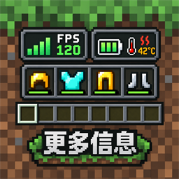
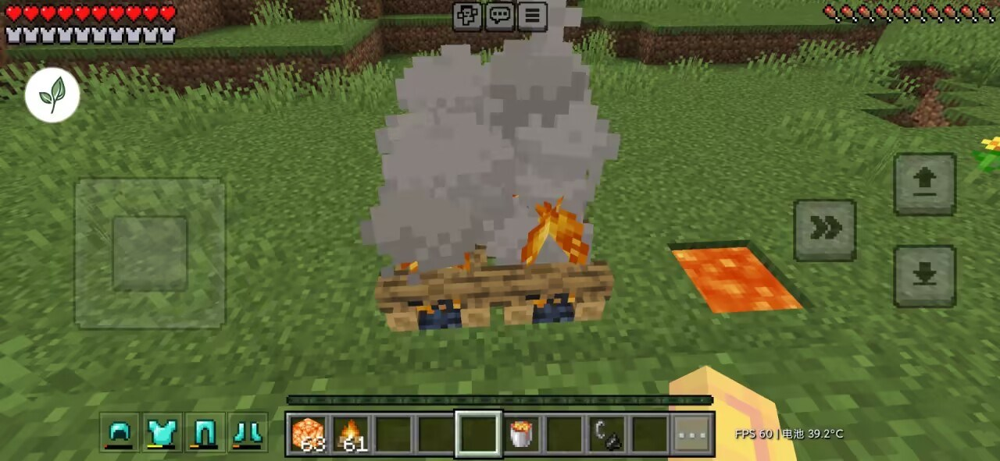
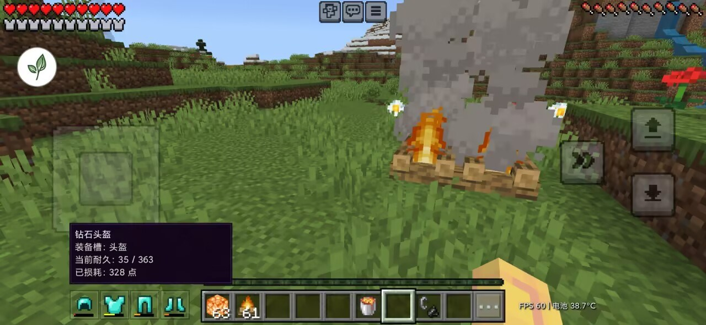
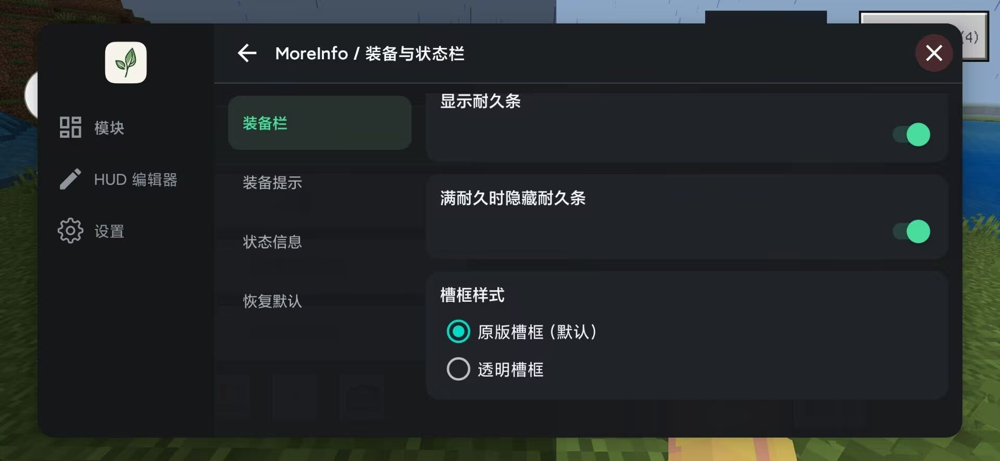
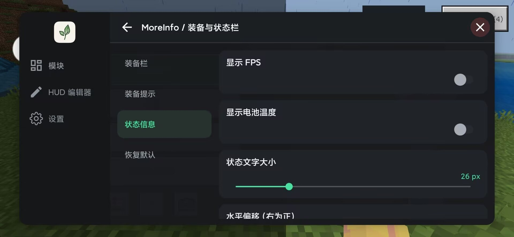

  

<h1 align="center">MoreInfo</h1>

把常用装备与设备状态放到快捷栏旁，查看信息不再来回打开背包。

<strong>简体中文</strong> · <a href="README.en.md">English</a>

MoreInfo 是为 Android 版 LeviLauncher 制作的游戏内信息显示模组。它在快捷栏左侧显示
四个已穿戴盔甲槽和副手槽，在右侧显示 FPS 与电池温度，并提供可即时生效的游戏内设置。

## 功能

- 在快捷栏旁显示头盔、胸甲、护腿和靴子
- 显示副手物品，并可双击副手槽与当前选中的快捷栏物品交换
- 当前快捷栏槽为空时，可双击副手槽把副手物品卸到该槽
- 使用游戏中的物品图标，并保留附魔光效
- 显示盔甲与副手物品的耐久条，满耐久时默认隐藏
- 长按盔甲或副手槽查看物品名称和精确耐久（当前 / 上限）
- 显示 FPS 与电池温度
- 自由调整位置、缩放和文字大小
- 可切换原版槽框或透明槽框
- 设置即时保存，无需每次重启游戏

副手交换只在短时间内连续点击两次副手槽时触发，并使用游戏原版网络库存请求。无法放入副手的物品不会被交换；
长按、拖动或多指操作也不会触发交换。

副手装入、替换、空手卸下以及世界与服务器之间的连续切换已在三个支持版本上完成测试。服务器仍可能按自身规则限制物品操作；请求被拒绝或超时后，MoreInfo 不会自动重试。

## 效果预览

### 快捷栏装备与状态信息

### 长按查看装备信息与精确耐久

### 装备栏设置

### 状态信息设置

## 支持版本

- Minecraft 1.26.44.3
- Minecraft 1.26.45.1
- Minecraft 1.26.50.4
- Android ARM64

请为实际使用的 Minecraft 版本安装对应支持版本。未列出的版本不会强行加载，以避免崩溃。

## 安装

1. 在 [Releases](https://github.com/188zhuyaqi/MoreInfo/releases) 下载最新的 `.levipack`。
2. 使用 LeviLauncher 导入安装包，并在目标实例中启用 MoreInfo。
3. 完全退出后重新启动游戏。
4. 进入世界后，可从模组菜单打开 **MoreInfo / 装备与状态栏** 调整显示。

如果启动器提示版本不兼容，请确认 Minecraft 的完整版本号在上方支持列表中，并删除旧版
MoreInfo 后重新安装当前版本。

## 说明

- 温度数据为设备的**电池温度**，不是 CPU 或 GPU 温度。
- 不同设备的系统状态数据可能存在短暂延迟或不可用情况。
- 遇到问题时，请在 [Issues](https://github.com/188zhuyaqi/MoreInfo/issues) 提供 Minecraft、
  LeviLauncher 与 MoreInfo 的完整版本号，并附上截图或相关日志。

作者：**zhuyaqi**
